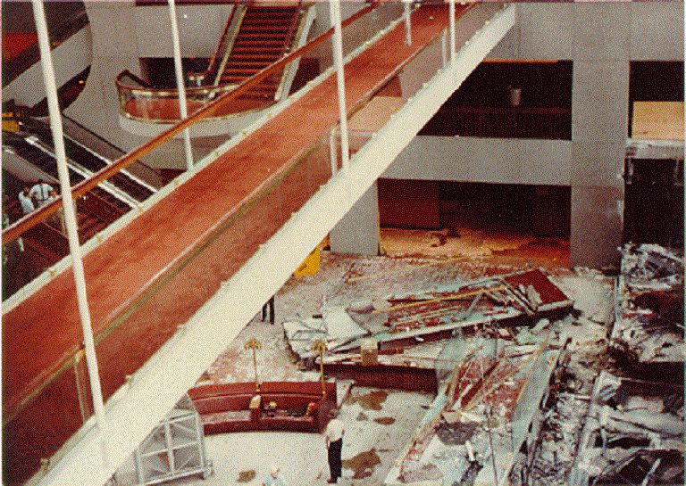
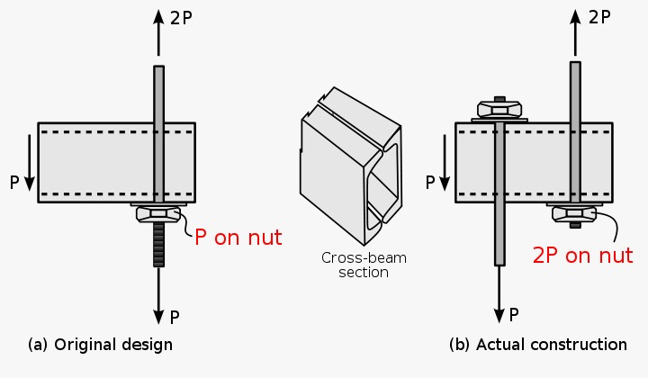

# Tragic Hyatt Regency Walkway Collapse

Pada 17 Juli 1981, lebih dari 100 orang tewas dan 200 lainnya terluka ketika dua jalan setapak runtuh di dalam Hotel Hyatt Regency Kansas City. Pada saat itu, Tea Dance sedang diadakan di lobi hotel ketika jalan setapak jatuh. Ini adalah keruntuhan struktural paling mematikan dalam sejarah AS hingga peristiwa tragis World Trade Center sekitar 20 tahun kemudian. ( https://interestingengineering.com/understanding-hyatt-regency-walkway-collapse )

### Explain why the incident happened

Hyatt Regency Kansas City Hotel mulai dibangun pada Mei 1978. Bangunan 40 lantai, meskipun mengalami beberapa kemunduran dan penundaan, dibuka untuk umum pada bulan Juli 1980. Satu kemunduran utama adalah runtuhnya dramatis atap atrium  ketika sambungan gagal di ujung utara gedung.
Jalan setapak konstruksi baja, kaca dan beton menghubungkan lantai kedua, ketiga dan keempat dari utara ke selatan. Setiap jalan setapak memiliki panjang sekitar 37 meter dan berat sekitar 29.000 kg . Begitulah desainnya, bahwa jalan tingkat keempat berada tepat di atas jalan tingkat kedua.
Saat bencana terjadi, 1.600 orang berkumpul untuk Tea Dance. Sekitar pukul 7 malam, jalan setapak tingkat dua memiliki sekitar 40 penonton. Jalan setapak tingkat ketiga dan keempat masing-masing menampung sekitar 16 dan 20 orang.

Selama konstruksi, cacat desain yang terlihat diidentifikasi. Kontraktor memutuskan untuk mengubah desain yang mengakibatkan pembebanan ganda pada sambungan antara jembatan lantai empat dan atap atrium. Balok penyangga dan batang pengikat telah dirancang untuk menahan beban setiap jalan dan orang yang berdiri di atasnya. Perubahan desain baru, meskipun tampaknya tidak kentara, cukup untuk secara kritis merusak keamanan struktur.
Koneksi gagal secara spektakuler, jembatan lantai empat dan lantai dua jatuh ke lantai atrium. Saat debu mengendap, tumpukan baja, beton, dan kaca menutupi banyak benda. Tim penyelamat kemudian akan menyamakan pemandangan itu dengan zona perang. Itu pasti pemandangan yang mengerikan.

### Explain the design error

Detail batang gantungan yang sebenarnya digunakan dalam pembangunan trotoar lantai dua dan empat adalah penyimpangan dari detail yang ditunjukkan pada gambar kontrak. Dalam pengaturan awal, setiap batang gantungan harus disambung dari jalan setapak lantai dua ke braket batang gantungan yang dipasang pada rangka atap atrium. Beban desain yang akan ditransfer ke setiap batang gantungan di jalan setapak lantai dua adalah 20,3 kips (90 kN). Beban yang pada dasarnya identik akan dipindahkan ke setiap batang gantungan di trotoar lantai empat. Dengan demikian, beban desain yang bekerja pada bagian atas batang gantungan kontinu akan menjadi dua kali lipat beban pada bagian bawah, tetapi beban desain yang diperlukan untuk sambungan batang gantungan balok kotak akan sama untuk kedua trotoar

Konfigurasi batang gantungan yang benar-benar digunakan terdiri dari dua batang gantungan: segmen batang gantungan lantai empat ke langit-langit seperti yang dirinci semula pada segmen lantai dua sampai lantai empat yang diimbangi ke dalam 4 inci (102 mm) sepanjang sumbu balok kotak. Dengan modifikasi ini, beban desain yang akan ditransfer oleh setiap sambungan batang gantungan balok kotak lantai dua tidak berubah, begitu pula beban pada segmen batang gantungan atas dan bawah. Namun, beban yang akan dipindahkan dari balok kotak lantai empat ke batang gantungan atas di bawah pengaturan ini pada dasarnya berlipat ganda, sehingga memperburuk kondisi yang sudah kritis. Beban desain untuk sambungan batang gantungan balok di lantai empat adalah 40,7 kips (181 kN) untuk konfigurasi ini.

Jika perubahan detail batang gantungan ini tidak dilakukan, kapasitas akhir sambungan batang gantungan balok kotak masih jauh dari yang diharapkan dari sambungan yang dirancang sesuai dengan Kode Bangunan Kansas City, yang didasarkan pada AISC Spesifikasi. Dalam hal kapasitas beban ultimit koneksi, nilai minimum seharusnya 1,67 kali 20,3, atau 33,9 kips (151 kN). Berdasarkan hasil pengujian, kapasitas ultimit rata-rata sambungan batang tunggal adalah sekitar 20,5 kips (91 kN), tergantung pada area pengelasan. Jadi, kapasitas akhir yang sebenarnya tersedia dengan menggunakan detail sambungan asli kira-kira 60% dari yang diharapkan dari sambungan yang dirancang sesuai dengan Spesifikasi AISC.