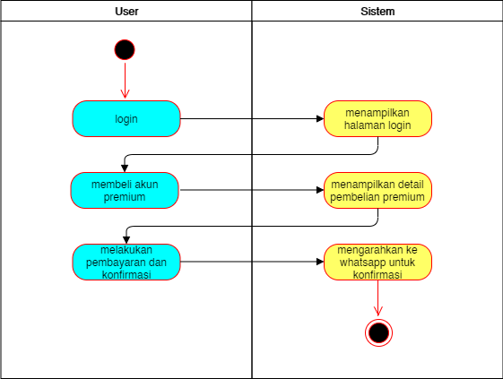

## Give reasoning why it isn’t pleasant or cumbersome to use
- Komik hot dan rekomendasi seharusnya dijadikan satu karena terlalu makan banyak tempat
- Pada tampilan detail terlalu ramai karena chapter dan informasi manga digabung

## Pointed out the flaw in interaction control
- Pada fitur "privacy policy" pengguna langsung diarahkan pada suatu situs web. 
- Untuk konfirmasi akun premium harus dilakukan manual dengan chat nomor whatsapp sang developer sehingga merepotkan pengguna
- Tampilan update terbaru seharusnya yang di highlight daripada komik hot.
- Tidak ada keterangan waktu pada update terbaru
- Tidak ada pencarian berdasarkan genre yang disukai

## Identify Key business use cases
Dari semua use case yang ada di Manga id, menurut kami key business use case nya adalah dengan melakukan pembelian akun premium, tujuan dari aplikasi ini adalah pembelian akun premium oleh user. Ketika user membeli akun premium, maka user tidak akan lagi menerima iklan ketika sedang membaca komik 

## Activity Diagram Key Business

